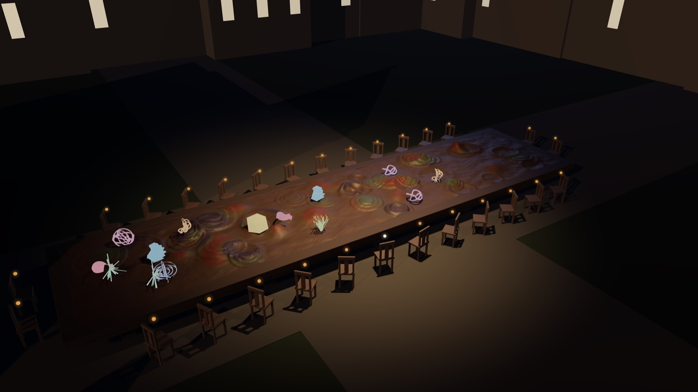

# The Oblong Table

An interactive rendering of a passage from the AI in Education report at the
University of Chicago, which asks the reader to imagine the University's
educational mission as a massive oblong table in the central Quad, strewn with
AI objects, with every faculty member seated around it.

The passage is already spatial, tactile and temporal — it describes something
you could stand next to. This builds that thing. You take a seat at the table,
pick up an AI object, choose what to do with it, and watch the surface record
your choice alongside everyone else's.

The full passage is in [docs/passage.md](docs/passage.md).



---

## Run it

```bash
npm install --prefix web && npm run dev --prefix web
```

Then open http://localhost:5173.

To build a static bundle that runs from anywhere with no server-side anything:

```bash
npm run build --prefix web
```

## Rebuild the 3D assets

The table, the Quad and the nine AI objects are generated by headless Blender
scripts rather than modelled by hand, so they are diffable and reproducible.
Two runs produce byte-identical `.glb` files.

```bash
/Applications/Blender.app/Contents/MacOS/Blender -b --python blender/build_all.py
```

Requires Blender 5.x. Writes to `web/public/models/`.

---

## What it does

**Three gestures.** The passage names three responses to an AI object and
pointedly refuses to rank them. Each stamps a visually distinct signature into
the table's surface, so the table read from above becomes a legible record of
collective judgment:

| Gesture | Terrain | Reads as |
|---|---|---|
| **Mold** it to your teaching agenda | broad smooth swell | a rise |
| **Place** it by a precise methodology | quantised plateau, hard rim | a terrace |
| **Set it aside**, deliberately | dimple ringed by a raised lip | a considered absence |

**A gathering already in progress.** You arrive at a table carrying 60 seeded
gestures split evenly across the three. Colleagues keep acting on their own,
and strands of conversation run between seats whether or not you do anything.

**Students.** The passage's closing clause gets its own beat. Periodically a
cool pulse arrives from beyond the ring of seats and shifts a whole region of
the table in a way no one seated put there — wide, shallow and rippled, unlike
any faculty mark.

**It keeps moving.** With nobody touching it the surface drifts continuously.
Over ten simulated minutes it retains its unevenness and does not sink.

---

## Design constraints

The hard problem here was editorial, not technical. Interactive pieces reward
action, and this passage declines to. Three rules the code is written to keep:

1. **The three gestures are peers.** Equal visual weight, equal effort, equal
   share of the seeded history and of what colleagues choose. Setting an object
   aside leaves a mark, not a blank. There is no score and no completion state.
2. **Unevenness is the goal.** The drift must never trend the table toward
   smooth. A table relaxing to flat would be the piece arguing for consensus.
3. **No figures.** Faculty and students are presences — light, warmth, motion.
   Modelled bodies would imply identity and land in the uncanny valley.

---

## Architecture

```
blender/          headless, scripted, reproducible asset build -> .glb
  build_table.py    oblong trestle table + one chair (instanced at runtime)
  build_quad.py     stylised gothic massing, four ranges, lit windows
  build_objects.py  nine AI object archetypes
web/src/
  table/topography.js   the heightfield: ping-pong render target, the core
  table/tableMesh.js    displaced surface patched into MeshStandardMaterial
  objects/gestures.js   the three commit paths
  seats/                presences, conversation filaments, the student beat
  state/                seeded gathering, localStorage history
```

### The topography

The table's relief is not geometry. It is a **live heightfield in a ping-pong
render target** (1024×224), so it can accumulate and then keep evolving:

- `R` height · `G` grammar · `B` age · `A` crispness
- a **stamp pass** applies gestures, batched eight per pass
- a **drift pass** erodes fine detail and adds a slow wander every frame
- the surface mesh patches `MeshStandardMaterial` via `onBeforeCompile`, so the
  relief keeps real PBR lighting and shadows; a matching depth material gives it
  self-shadowing rather than casting as a flat slab

Two findings worth recording, both of which took measurement rather than
reasoning to pin down:

- **The targets must be fp32, not half float.** The field is integrated in place
  across thousands of frames. At half precision the per-frame increments fall
  below the ULP of the value they are added to, round away, and the table
  quietly decays to flat — 7% of its variance left after ten simulated minutes,
  versus ~100% at fp32. It falls back to half float where fp32 is not
  renderable, at the cost of long-session stability.
- **Drift must add the wander field's *difference*, not the field.** Adding the
  field is a random walk: the whole table creeps until it pins against the
  clamp. The difference telescopes, so the surface wanders inside a bounded
  envelope however long it is left running.

---

## Verify it

Blender build is idempotent and reports its own geometry:

```bash
/Applications/Blender.app/Contents/MacOS/Blender -b --python blender/build_all.py
```

In the browser console, `window.__oblong` exposes the whole runtime. The
long-run drift behaviour — the property most likely to regress — can be checked
by driving the simulation forward without waiting for it:

```js
const { topography } = window.__oblong
for (let i = 0; i < 12000; i++) topography.update(0.05)   // 10 minutes
```

Then compare the variance of the `R` channel before and after. It should hold
(unevenness preserved) with the mean essentially unchanged (no sink).

Measured on an M2 Pro: 60 fps at retina, 131k triangles in the surface, ~12k in
the scene, 420 KB of assets, 219 KB gzipped JS.

---

## Attribution

The passage is quoted in [docs/passage.md](docs/passage.md) with a **placeholder
citation** — the exact title, authorship and date could not be verified from
public sources at build time, and should be filled in before this is shown
publicly.
